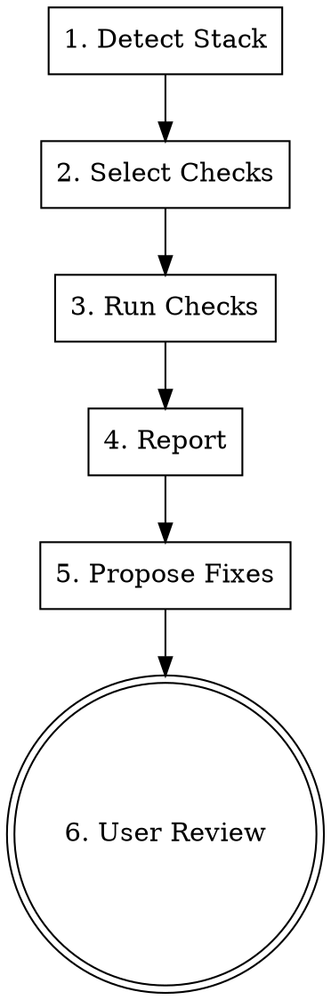

# Codebase Doctor

Language-agnostic codebase audit. Detect project stack, check essential application features, report findings, and propose fixes with mandatory user review.

## Workflow



### Step 1: Detect Stack, Guidelines & Phase

**1a. Detect stack** from manifest files:
- Language(s) and framework(s) (package.json, go.mod, Cargo.toml, pyproject.toml, etc.)
- Project type: CLI, web API, library, desktop app, etc.
- Components: database, external APIs, message queues, etc.

Use Glob and Read on manifest files. Do NOT ask the user — detect automatically.

**1b. Read AI agent guidelines** (AGENTS.md, CLAUDE.md, or equivalent) if present. This provides project-specific conventions (tech stack, commands, logging rules, coding standards) that inform all subsequent checks. For example, if AGENTS.md specifies "use slog for logging", the Logging check should verify slog usage specifically — not just any logging library.

**1c. Determine the phase.** The phase decides which checks get weight. Take an explicit statement from the user over inference（「テストフェーズに入る」→ `test`）. With no statement, infer from the repository:

| Phase | Signals | Weighted checks |
|-------|---------|-----------------|
| `setup` | few commits, no tests, no CI, no CLAUDE.md | 1, 12, 13, 16 — guidelines, permissions, stack-matched skills, toolchain |
| `build` | source growing, tests thin or absent, no deploy config | 2-5, 13, 14, 16 — implementation basics, skills, automation, toolchain |
| `test` | tests exist or user says testing is starting; CI config present | 6, 6b, 9, 10, 12, 13, 16 — testing, test-design knowledge, validation, test-command permissions, testing skills, CI wiring |
| `release` | deploy config, tags/releases, production branch | 4, 11, 12, 15 — config, security, permissions, remote execution |

State the detected phase in the report. Checks outside the weighted set still run, but fixes for them are proposed at lower priority.

### Step 2: Select Applicable Checks

Based on detected stack, select from the check catalog below. Skip checks that don't apply (e.g., skip "Database Migrations" if no DB detected).

**Check execution order**: Run Check 1 (AI Agent Guidelines) first — its findings calibrate subsequent checks. Settle Check 6 (Testing) before finalizing any other rating, because a Testing `[FAIL]` adds the `[*]` suffix to every other check (see Check dependencies below). Other checks can run in any order.

**Idempotency (MANDATORY)**: this skill runs repeatedly over a project's life. Never propose what already exists. Read the current state first — installed skills, existing permission entries, existing hooks — and diff against what the phase needs. Report an already-satisfied item as `[PASS]` and propose nothing for it. Never overwrite a hand-written CLAUDE.md, permission list, or hook; propose additions only.

### Step 3: Run Checks

For each selected check, search the codebase for evidence of implementation. Use Grep (rg-based, regex `|` for alternation) and Glob with language-appropriate patterns. See `references/check-patterns.md` for per-language search patterns.

If the detected language has no predefined patterns in `check-patterns.md`, infer patterns from the language's ecosystem (common libraries, idioms). Note `[inferred]` in the report for transparency.

**Check dependencies (MANDATORY)**: If Testing is `[FAIL]` (tests don't compile/run), you MUST add `[*]` suffix to every other check's rating in both terminal output and report (e.g., `[PASS*]`). This signals that the check result could not be verified by tests. Add a footnote: `[*] Testing is FAIL — result not verified by tests.` This is important because static pattern matching alone cannot guarantee correctness.

Rate each check:

| Rating | Criteria |
|--------|----------|
| `[PASS]` | Library/pattern found AND used consistently across the codebase |
| `[WARN]` | Found but inconsistent (e.g., logging in some files, print in others) or config exists but no validation |
| `[FAIL]` | No evidence found, or anti-pattern detected (e.g., empty catch blocks) |
| `[SKIP]` | Not applicable to this project type |

### Step 4: Report

Output both:
1. **Terminal**: Summary table with ratings
2. **File**: `.context/doctor/YYYYMMDDHHmmss_doctor_report.md` (timestamp at generation time)

Terminal format:
```
=== Codebase Doctor Report ===
Stack: Go / CLI+Server / SQLite
Phase: test (user-stated)

[PASS] Logging .............. slog structured logging detected
[FAIL] Error Handling ....... errors swallowed in 3 locations
[WARN] Configuration ........ env vars used but no validation
[PASS] Graceful Shutdown .... signal.NotifyContext found
[SKIP] Input Validation ..... no external input boundary detected
[PASS] Testing .............. 42 test files, go test configured
[PASS] Dependency Lock ...... go.sum present and tracked in git
[FAIL] Database Migrations .. raw CREATE TABLE, no migration tool

Score: 4.5/7 (4 PASS, 1 WARN, 2 FAIL, 1 SKIP)
```

Scoring: `PASS=1, WARN=0.5, FAIL=0, SKIP=excluded from total`. Score = sum / (total - skipped).

Report file structure (`.context/doctor/YYYYMMDDHHmmss_doctor_report.md`):
```markdown
# Codebase Doctor Report
**Date**: YYYY-MM-DD HH:mm:ss | **Stack**: ... | **Phase**: ... | **Score**: X/Y

## Summary
(terminal format table above)

## Detailed Findings
### [RATING] Check Name
**Finding**: what was found (with file paths and line numbers)
**Impact**: why it matters
(repeat per check)

## Fix Proposals
### [RATING] Check Name (Priority: High/Medium/Low)
**What**: brief description
**Where**: specific file(s) and location(s)
**How**: minimal code example
(repeat per FAIL/WARN)

## User Review
List of proposals for user to approve/reject.
```

### Step 5: Propose Fixes

For each `[FAIL]` and `[WARN]` item, propose a concrete fix:
- What to implement (brief description)
- Where to implement (specific files/locations)
- Example code snippet (language-appropriate, minimal)

### Step 6: User Review (MANDATORY)

**NEVER auto-apply fixes.** Always:
1. Present all proposals as a list
2. Ask the user which fixes to apply
3. Only implement approved fixes
4. After implementation, re-run the affected checks to verify

## Check Catalog

### Core Checks (always evaluate, in order)

#### 1. AI Agent Guidelines
- AGENTS.md, CLAUDE.md, or equivalent project guideline file exists
- Defines: tech stack, build/test commands, project structure
- Defines: coding conventions (logging, error handling, naming, etc.)
- **PASS**: guideline file exists with stack, commands, and conventions defined
- **WARN**: file exists but incomplete (e.g., stack listed but no conventions)
- **FAIL**: no guideline file found
- **Impact on subsequent checks**:
  - **PASS/WARN**: If guidelines define specific rules (e.g., "use slog"), subsequent checks validate against those rules — not just generic patterns. This tightens the audit.
  - **FAIL**: No project-specific rules available. Subsequent checks fall back to generic ecosystem patterns only. Note this in the report: "No project guidelines found — checks use generic patterns."
- **Fix**: on `[FAIL]`, propose running `/init` — it authors a CLAUDE.md from the codebase. On `[WARN]`, propose `claude-md-improver` to fill the gaps. This skill detects the absence; it does not write the file itself

#### 2. Logging
- Structured logging library in use (not just print/println)
- Log levels (debug/info/warn/error) available
- **Signals**: import of logging library, logger initialization

#### 3. Error Handling
- Consistent error handling pattern (not swallowed/ignored)
- Errors propagated or logged, not silently dropped
- **Signals**: empty catch blocks, `_ = err`, unchecked return values

#### 4. Configuration
- Externalized config (file, env vars, or flags — not hardcoded)
- No secrets/credentials committed in source
- **Signals**: config file loading, env var reads, .env in .gitignore

#### 5. Graceful Shutdown
- Signal handling (SIGINT/SIGTERM)
- Resource cleanup on exit (DB connections, file handles, goroutines)
- **Signals**: signal.Notify, process.on('SIGTERM'), atexit, shutdown hooks

#### 6. Testing
- Test files exist
- Test runner configured (scripts, CI config, or Makefile)
- Reasonable coverage (not zero)
- **Signals**: test file patterns, test commands in scripts

#### 6b. Test-design knowledge layer

Rated separately from 6 — a project can have a healthy test suite and still have none of
this, and vice versa. Do not fold this into the `6. Testing` rating.

The global `testcase-generator` skill carries the product-independent half of test design
(input/boundary/abnormal values, calculation first, Gherkin style, forbidden vague wording).
It reads a project-specific half on top of that when one exists. This check reports whether
that half is present. **Only presence — never judge the contents.**

| File | When it applies |
|---|---|
| `perspectives.md` | always — this product's own "what tends to break here" |
| `ui-terms.md` | only when the project has a UI — internal names ↔ on-screen labels |
| `playbook.md` | when tests exist, or the phase is `test` — the preconditions a run needs |

**Do not define the paths here.** `references/perspectives-common.md` of the `testcase-generator`
skill (testing plugin; section "プロジェクト固有の観点") is the single source for where these live.
Read it and use what it says. A second copy of the layout here would drift from the first one.
If the testing plugin is not installed, rate this check **SKIP** (excluded from the score) and say
the testing plugin is missing.

**Which files apply**: `perspectives.md` always. `ui-terms.md` only when the project has a
UI — that is, the detected stack renders something a person operates in a browser or a
native window (a frontend framework, server-side templates, or static assets served to a
client). A backend-only API, a batch job, an ETL, a CLI, or a library has no UI.
`playbook.md` when tests exist or the phase is `test`.

Rate in this order — the four buckets are exhaustive, so every run lands in exactly one:

- **SKIP**: the phase is `setup` (there is nothing to design against yet), or the
  repository has no test target at all (docs-only, config-only), or the testing plugin is not
  installed (the layout cannot be read)
- **PASS**: every file that applies is present
- **WARN**: at least one applies and is present, but not all of them are
- **FAIL**: none of the files that apply are present

**Do not put the phase into the PASS/WARN/FAIL decision.** The phase decides *how loudly*
to report (Step 1c weights checks; Step 5 orders fixes), not whether the check holds.
- **Fix**: delegate to `testcase-generator`. **Do not write the files here** — see Boundaries.
  When proposing, say plainly that the templates ship empty on purpose: a perspective file
  whose content was guessed reads as finished while carrying nothing, which is the failure
  mode this whole layer exists to prevent. The contents come from someone who has watched
  this product break.

#### 7. Dependency Management
- Lock file present (go.sum, package-lock.json, Cargo.lock, poetry.lock, etc.)
- Lock file tracked in VCS (verify with `git ls-files <lockfile>`, not just .gitignore)
- **Signals**: lock file in project root, tracked in git
- Note: `requirements.txt` is a dependency declaration, NOT a lock file. Look for `poetry.lock`, `Pipfile.lock`, `uv.lock` for Python.

### Conditional Checks (when component detected)

#### 8. Database Migrations (if DB detected)
- Schema changes managed by migration tool or versioned files
- Not raw CREATE TABLE in application code
- **Signals**: migration directory, migration library import

#### 9. Input Validation (if external input boundary detected)
- Validation at API endpoints, CLI args, or form handlers
- **Signals**: validation library, manual checks at handler entry points

#### 10. API Error Responses (if HTTP API detected)
- Consistent error response format (error struct/helper, not ad-hoc strings)
- Appropriate HTTP status codes (not everything 200 or 500)
- **Signals**: error response helpers, status code constants, error middleware

#### 11. Security Basics (if web-facing)
- CORS configuration
- Authentication/authorization middleware
- Parameterized queries (no string-concatenated SQL/commands)
- **Signals**: CORS middleware, auth middleware, prepared statements, parameterized queries
- **Scope**: this verifies the basics are *configured*. It is not a vulnerability hunt — when the project is security-sensitive or the basics are `[FAIL]`, hand off to the `security-review` skill for depth

### Project Configuration Checks (agent working environment)

These look at how well the project is set up **for agent work**, not at the application itself. All of them are diff-based: compare what the phase needs against what is already there.

#### 12. Agent Permissions
- `.claude/settings.json` exists and its `permissions.allow` covers the commands this phase actually runs (build, test, lint, package manager)
- No blanket wildcards that defeat the point of the prompt
- **Signals**: `.claude/settings.json`, `.claude/settings.local.json`; compare entries against the build/test commands found in Check 1 and the manifest
- **PASS**: routine commands for this phase run without a prompt
- **WARN**: settings exist but this phase's commands are missing (e.g. entering `test` with no test-runner entry)
- **FAIL**: no settings file, or every command prompts
- **Existing `deny` entries are deliberate restrictions (MANDATORY)**: never propose removing or overriding one. If the phase needs a command that a `deny` blocks, propose a narrower pattern-scoped `allow` and state what the `deny` is protecting against. Example: a project scaffolded from a template may deny whole-suite test runs on purpose (to stop an agent from looping on the full suite) while allowing pattern-scoped runs — entering `test` phase must not undo that
- **Fix**: delegate to the `update-config` skill. For entries derived from actual usage, `fewer-permission-prompts` reads the transcripts

#### 13. Project-scoped Skills
- The stack and phase have matching skills in `<project>/.claude/skills/`
- **How to decide what is missing**:
  1. List what is installed — `ls <project>/.claude/skills/` and `<project>/skills-lock.json`
  2. Map the detected stack and phase to capabilities (Next.js → React optimization / UI review; Cloudflare Workers → Workers idioms; entering `test` → browser and E2E testing; entering `release` → deploy and threat modeling)
  3. Look those capabilities up in the user's skill catalog, if they keep one (an index of skill stores by what they give you)
  4. **Only if the catalog has no store for it (or there is no catalog)**, search with `find-skills` / `npx skills find <keyword>` — and add any newly found store to the catalog if one exists
- **PASS**: the capabilities this phase needs are installed
- **WARN**: partially covered, or a store exists in the catalog but nothing is installed from it
- **FAIL**: nothing installed for a stack with obvious coverage
- **Fix**: `npx skills add <store> --skill <name> -a claude-code -y` (no `-g` — this is project scope). Never install without user approval

#### 14. Hooks & Automation
- Repeated manual steps, or operations that must be blocked, are wired into `.claude/hooks/`
- **Signals**: `.claude/hooks/`, `settings.json` の `hooks`; look for steps the user has corrected more than once
- **PASS**: recurring corrections and forbidden operations are covered
- **WARN**: candidates exist but nothing is wired
- **SKIP**: no repeated pattern yet (normal in `setup`)
- **Fix**: delegate to the `hookify` skill

#### 15. Remote Execution Setup
- The repository can be brought up in a cloud environment (claude.ai/code, Cowork VM) when the work needs it
- **Signals**: `.claude/` の session-start scaffold, `environment-setup.sh`
- **SKIP** unless the project is actually intended to run remotely — do not propose this by default

**When remote execution IS intended, two things need checking.**

**(a) Does the agent environment reach the cloud?** Cowork and cloud sessions do **not** read `~/.claude/skills/` (documented). Three routes get a skill there:

| Route | Reaches | Note |
|---|---|---|
| Enabled for the claude.ai account | Cowork **and** cloud | Synced at session start. Managed in Customize → Skills |
| Committed to the repo's `.claude/skills/` | Cloud only | Best for anything the team shares |
| Shipped in a plugin declared in the repo's `.claude/settings.json` | Cloud only | Plugins enabled only in user settings do **not** transfer |

Re-run Check 13 through this lens: for each skill this project depends on, confirm it is on one of these routes. If it is only in `~/.claude/skills/`, propose committing it to the repo (route 2), and mention route 1 for anything the user wants across all their cloud work. Same rule for user-level settings — a cloud session reads the repo's `.claude/settings.json` and org managed settings only.

**(b) Is an existing scaffold still sound?** When `setup.sh` / `steps.sh` / `environment-setup.sh` are present, verify — do not regenerate:

- The remote gate (`CLAUDE_CODE_REMOTE` / `CLAUDE_CODE_ENTRYPOINT=remote_*` / `REMOTE_SETUP_FORCE=1`) is intact. **A weakened or removed gate is `[FAIL]`** — it means the scaffold can fire locally
- `environment-setup.sh` is self-contained (no references to in-repo scripts — the repo does not exist yet at that layer)
- Every step ends `exit 0` (a non-zero exit fails session startup)
- The SessionStart hook has an explicit `timeout` (default is 60s)
- Provisioning stays within roughly 5 minutes, or the environment cache cannot be built

- **Fix**: delegate to the `remote-setup` skill — it owns generation and knows the two-layer split (environment vs session). This check only detects absence and breakage

#### 16. Toolchain
Whether the project's lint / format / test / CI machinery is wired — not whether the code passes it (that is Checks 2-6).

- **Linter** configured for the detected language: `.eslintrc*` / `eslint.config.*`, `ruff.toml` or `[tool.ruff]` in `pyproject.toml`, `.golangci.yml`, `clippy.toml`
- **Formatter** configured **and not fighting the linter** — a formatter with no linter-conflict rules disabled is a `[WARN]`, because the two will churn the same lines
- **Test runner wired to a command**, not merely test files present (`scripts.test`, `Makefile` target, `pyproject` entry)
- **CI actually runs lint + typecheck + test** — read the steps in `.github/workflows/*.yml`, don't assume from the file's existence
- **Repo hygiene files**: `.gitignore`, `.gitattributes`, `.editorconfig`
- **PASS**: all applicable pieces wired and CI runs them
- **WARN**: pieces exist but disconnected (linter installed but no CI step; formatter and linter conflict)
- **FAIL**: none configured
- **Fix**: if the project has `.claude/commands/init/setup.md`, **propose running `/init:setup` rather than proposing individual tool installs** — that command is interactive, reads the project's own metadata, and merges instead of overwriting. Only when no such command exists, propose the tools directly

## Boundaries with other skills

This skill **audits and proposes; it does not build**. When a fix needs building, hand it to the skill that owns it. Run this one first when the question is "what is missing", then delegate each fix.

| To actually do this | Use | Why not this skill |
|---|---|---|
| Author a CLAUDE.md from scratch | `/init` | Check 1 detects its absence; it does not write the file |
| Rewrite or improve an existing CLAUDE.md | `claude-md-improver` | same — detection only |
| Add or relocate permission entries | `update-config` | Check 12 reports the gap; that skill edits settings.json |
| Derive an allowlist from real usage | `fewer-permission-prompts` | it reads transcripts, which this skill does not |
| Wire a hook | `hookify` | Check 14 spots the candidate only |
| Scaffold the project's test-design knowledge layer | `testcase-generator` | Check 6b detects absence only; that skill owns the layout |
| Install lint/format/test/CI interactively | the project's `/init:setup` when it exists | Check 16 defers to it rather than installing tools itself |
| Set up a cloud execution environment | `remote-setup` | Check 15 is SKIP by default |
| Hunt for vulnerabilities | `security-review` | Check 11 only verifies the basics are configured |
| Review a diff or a PR | `code-review` | this skill audits the whole project, not a change |
| Find and install a skill by capability | the user's skill catalog (if any) → `find-skills` | Check 13 uses that route; it is not a search tool itself |

## Adding Custom Checks

Users can request additional checks during the session. When asked, add them to the audit dynamically. Common additions:
- Internationalization (i18n)
- Accessibility (a11y)
- Performance monitoring
- Rate limiting
- API versioning
